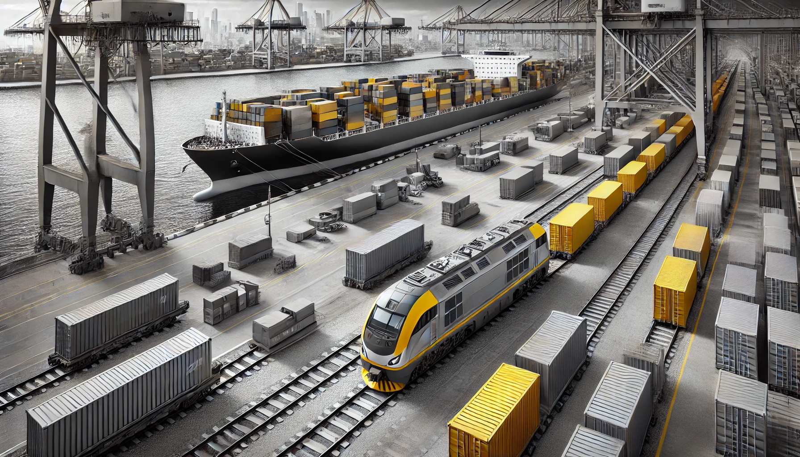

<!-- This is the markdown template for the final project of the Building AI course, 
created by Reaktor Innovations and University of Helsinki. 
Copy the template, paste it to your GitHub README and edit! -->

# Project Title
**Container Storage Cost Optimization**

## Summary

The *Container Storage Cost Optimization* project leverages machine learning to predict storage costs for containers in logistics yards. This tool aids logistics companies in optimizing cost planning, improving yard efficiency, and enhancing customer satisfaction. Developed as part of the *Building AI* course project, the solution provides actionable insights to reduce operational costs and streamline container management.

---

## **Background**

Efficient container storage management is critical for logistics companies like **Medlog Austria**, where storage costs can escalate due to:  
- Unpredictable container durations.  
- Inefficient space utilization.  
- Unclear cost structures.  

These challenges result in:  
✅ Increased operational expenses.  
✅ Limited transparency for clients.  
✅ Suboptimal resource allocation.  

**Objective**:  
The project uses **AI-driven predictions** to accurately estimate storage costs and recommend optimization strategies, leading to significant **financial and operational benefits**.

---

## **How is it Used?**

The solution integrates seamlessly with existing **Yard Management Systems** (YMS) and requires the following key inputs:  
- **Arrival and departure dates** of containers.  
- **Container size and type** (e.g., 20ft, 40ft, dry, reefer).  
- **Storage metrics** like utilization rates.  

### **Outputs**:  
- Predicted **storage costs** per container.  
- **Recommendations** for space allocation optimization.

**Example Use Case**:  
A yard manager can use the AI model to estimate costs during peak operational periods and plan container movements to avoid congestion.

---

## **Key Features and Interface**

- **Accurate Cost Predictions**: Based on historical and current container data.  
- **Dynamic Optimization**: Insights to improve space utilization and reduce costs.  
- **User-friendly Visualization**: Trends and predictions presented for actionable decision-making.  

📊 *Placeholder:*  


---

## **Data Sources and AI Methods**

### **Data Sources**  
- Historical container movement logs (arrival/departure).  
- Yard utilization metrics.  
- Cost data, including storage rates and penalties.

### **AI Methods Used**  

| **AI Technique**       | **Purpose**                         |  
|-------------------------|-------------------------------------|  
| **Regression Analysis** | Predict storage durations and costs |  
| **Clustering**          | Identify patterns in storage usage |  
| **Visualization Tools** | Present predictions and insights    |

---

## **Challenges**

Despite the project's effectiveness, the following limitations exist:  
- **Real-time disruptions**: The model does not yet account for unexpected events like congestion or delays.  
- **Reliance on historical data**: Accuracy may be reduced if historical data does not reflect future trends.  
- **Ethical considerations**: Ensuring unbiased and fair cost predictions across different operational scenarios.

---

## **Future Enhancements**

Planned improvements include:  
1. **Real-time data integration** for dynamic cost updates.  
2. **Scalability** to optimize costs across multiple yards and ports.  
3. **Automated container allocation** to further reduce storage costs and improve efficiency.

Collaboration with logistics experts and access to larger, real-time datasets will be key to achieving these goals.

---

## **Getting Started**

### **Dependencies**  
- Python 3.x  
- Required libraries: `pandas`, `scikit-learn`, `matplotlib`, `plotly`, `statsmodels`  

### **Installation**  
Clone this repository and install dependencies using pip:  
```bash
git clone https://github.com/vaquerogrd/Container-Storage-Cost-Optimization.git  
cd Container-Storage-Cost-Optimization  
pip install -r requirements.txt  


